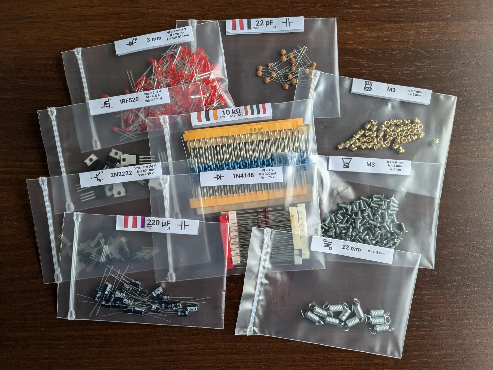

# ComponentLabels (UK / Avery L7159 fork)

This script generates labels for zip bags with all sorts of electronic or mechanical components.

> **Fork notes.** This is a UK-friendly fork of [prochazkaml/ComponentLabels](https://codeberg.org/prochazkaml/ComponentLabels) on Codeberg. The differences from upstream are:
>
> - Adds a preset for **Avery L7160** (A4, 21 labels per sheet, 63.5 × 38.1 mm) — the most widely-stocked label sheet in UK stationers. **J8160** is registered as an alias.
> - Adds a preset for **Avery L7159** (A4, 24 labels per sheet, 63.5 × 33.9 mm), with **J8159** and **LR7159** as aliases.
> - Default layout switched to **L7159**.
> - Adds a proper command-line interface (`--layout`, `-o/--output`, `--list-layouts`) so you no longer need to edit `main.py` to pick a sheet or output filename.
>
> Both new presets have been print-tested on real Avery sheets (May 2026). You should still do your own dry run on plain A4 first — see the printing notes below — because alignment depends on your specific printer.

It is primarily meant for [these](https://www.obalyvysocina.cz/produkty/samolepici-etikety) labels (70x25.4 mm) and [these](https://www.obalyvysocina.cz/produkty/rychlouzaviraci-sacek-extra-pevny#rychlouzaviraci-sacek-silny8x12) 8x12 cm zip bags. The generator also supports AVERY L7159 (default in this fork), L7160, 5260, L7157, [J8157](https://github.com/prochazkaml/ComponentLabels/pull/1), J8160, and EJ Range 24 labels.



## Supported components

- Resistors (resistance, 3 & 4 digit SMD code, EIA-96 code and 3 & 4 band color codes)
- Capacitors (capacitance, 3 digit SMD code, EIA-198 code and 3 band color code (yes, those appear to actually exist))
- Diodes & Schottky diodes (name, forward voltage/current, reverse voltage)
- Zener diodes (name, reverse voltage/current, forward voltage)
- LEDs (diameter/name, forward voltage/current, wavelength)
- PNP/NPN BJT (name, base-emittor voltage, collector-emittor voltage/current)
- P/N-channel MOSFET (name, gate-source voltage, drain current, drain-source voltage)
- Square/Hexagonal nuts (thread type, thickness, width and diameter)
- Washers (thread type, thickness, diameter)
- Recessed/Round-head/Flat-head screws (thread type, head width, head height and screw length)
- Threaded inserts for 3D prints (thread type, diameter and length)
- Compression/Extension springs (diameter and length)

# Usage

- Install python3
- Install the python3 library `reportlab` (`pip install -r requirements.txt`). This library is used to do the actual PDF generation.
- Edit the component list in `main()` of `src/main.py` to match the components you want to label.
- Run the script:

```sh
python3 LabelGenerator.py                      # defaults to Avery L7159 → ComponentLabels.pdf
python3 LabelGenerator.py --layout 5260 -o letter.pdf
python3 LabelGenerator.py --list-layouts       # show all available presets
```

`--layout` is case-insensitive and accepts both short (`L7159`) and full (`AVERY_L7159`) names. J8159 is treated as an alias for L7159 — they have identical physical layouts.

## Printing — important

**Print at 100 % / "Actual size".** Disable any "Fit to page" or "Scale to printable area" option in your printer dialog. If the PDF is scaled, labels will not align with the sheet and you'll waste a sheet of stickers.

Before committing to a £15 box of labels, do a dry run on plain A4: print one page at 100 %, hold it against a real label sheet up to a window, and confirm the rectangles overlay within ~1 mm. The included `scripts/check_alignment.py` (see below) can also overlay the generated PDF on a scanned blank label sheet.

# Label alignment helper script

A [helper script](scripts/check_alignment.py) is available to assist with creating new label definitions.

If you scan a blank sheet of labels of your choice that you want to create definitions for, this helper script can overlay the scanned blank page (with the seams between the individual labels visible) with your generated labels. This way, you can verify that your new label definitions are correct *without the need to print anything*.

For example: `./scripts/check_alignment.py --template scanned_labels.pdf --labels ComponentLabels.pdf --output combined.pdf` will produce a file named `combined.pdf` that will have the scanned labels as a background for each page and the generated labels overlayed on top.

Of course, this script assumes that your scanner is properly aligned and set to the same page size as your generated labels.

# Credits

This UK fork is based on [prochazkaml/ComponentLabels](https://codeberg.org/prochazkaml/ComponentLabels), which is itself forked from https://github.com/securelyfitz/ResistorLabels — in turn a fork of https://github.com/Finomnis/ResistorLabels.

The original is based on an idea from Zach Poff. For more details on how to use these labels, visit [Zach's website](https://www.zachpoff.com/resources/quick-easy-and-cheap-resistor-storage/).

